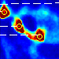
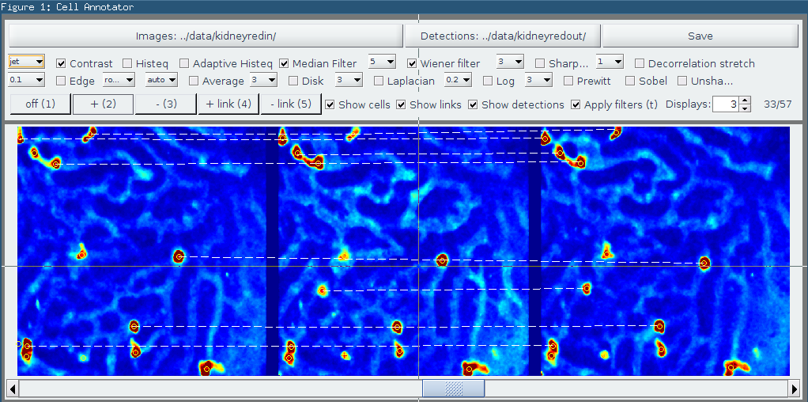

 Cell Annotator
===================================

A utility to facilitate the annotation of cell images with dots and connect the cells between consecutive frames (links).

Dots represent the centroids of cells, while links connect the same cells across consecutive frames.



Two applications are provided:
	
* Image Sequence Annotation Tool: the tool to annoated images
* Annotated Trajectory Viewer: a tool that displays the annotated trajectories in a temporal (3D) view.

## Possible applications

The main goal of this application is the annotation of cells in image sequences, however it can be used for the annotation of any kind of images with dots, for example a particle system.

## Installation

The application be be installed using the provided binaries, or run directly from MATLAB.
The binaries were generated by MATLAB and can be run using the free MATLAB Compiler Runtime, which is automatically installed.

* Image Sequence Annotation Tool:
	- Binaries in folder `bin/for_redistribution`
	- Main MATLAB file: `cellAnnotator.m`

* Annotated Trajectory Viewer:
 	- Binaries in folder `TrackletViewerApp/for_redistribution`
 	- Main MATLAB file: `TrackletViewerApp.m`

## Requirements

The MATLAB Compiler Runtime (installed automatically if missing)

## Features

* Display sequence of images, up to 10 images in a single screen
* Dot annotations
* Link annotation (connection between consecutive images)
* Wide range of optional filters to improve the visibility of the cells
* Shortcuts for many things
* Overlay of a different annotation set, for example one obtained using a cell detection algorithm.
* Resizable interface
* Full image mode with shortcut 'f'
* Helper mask for linking cells in densely populated images

## File format

The application requires that images and annotations are stored in the same folder, using the following structure:

```
dataFolder
	|- im[0-9]+.pgm 
	|- im[0-9]+.mat
```
The image file format is limited to `pgm` files, but this can be easily configured within the script.

The `mat` should contain two variables (if the variables are not existent, they will be created) called `dots` and `links`.

`dots` is a `nCells x 2` matrix containing `x`- and `y`- coordinates of cell positions. For example:
```
dots =

         252         292
          46         323
          81         399
```

`links` is a `nCells x 1` matrix containing for each cell the index of the linked cell in the next image, or 0 if there is no link. For example:

```
links =

     1
     0
     3
```

## Known bugs

* If an action (eg add link) is being used and the window is closed, a new blank figure will open.
* Cannot use scroll wheel to scroll between images when an action is being used (e.g. add dot annotation)
* The first click on the image to add an annotation takes several seconds.

## TODO

Please, see the TODO file for a list of remaining tasks

## Pull requests

Good pull requests—patches, improvements, new features—are a fantastic help. They should remain focused in scope and avoid containing unrelated commits.

## Related repositories

* [MSc dissertation](https://github.com/pedrokost/cell_tracking_msc_report)
* [Automatic Cell Detector and Tracker](https://github.com/pedrokost/cell_detector_and_tracker)

## Changelog

* Image Sequence Annotation Tool:

	* Changelog 1.4 (9.8.2014):
		- NEW: 'h' shortcut hides tracks that are complete
		- UPGRADE: Dot annotations now drawn the same color as the links

	* Changelog 1.3 (9.8.2014):
		- NEW: Links are also shown for the leftmost and rightmost images
		- NEW: Potential link annomalies are now shown in a different style (full width, thicker)
		- REGRESSION: The image number is no longer accurate when watching the head/tail of the sequence
		- BUGFIX: Reloading detections using the Load Detections button no longer takes you back to the Data folder each time, but stays in the same (detection) folder

	* Changelog 1.2:
		- NEW: colored links
		- BUGFIX: fix repeated cursor blinking when switching tool

	* Changelog 1.1:
		- NEW: Fullscreen toggle with 'f'
		- NEW: Helper mask for adding links
		- BUGFIX: Support for MATLAB 2014b new graphics engine
		- BUGFIX: Improved plotting performance (less rerendering)
		- NEW: faster tool to annotate links


* Annotated Trajectory Viewer:
	
	* Changelog 1.1 (9.8.2014)
		- NEW: Resizable window